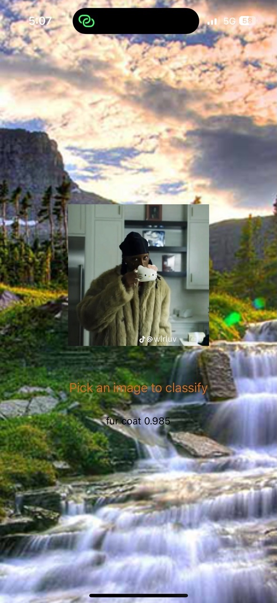

# Object identification sample react-native project

## How to start this project
Run following command first in terminal
```
yarn install
```
And then run following to start npx to text

```
npx expo start
```

## Some sample pages are

1. Sample Image with 98.5% confidence prediction



